# Coro

## Пререквизиты

- [(рекомендуется) long-jump](../long-jump)

## Корутины

В этой задаче вы напишите собственные корутины:

```cpp
auto c = Coroutine::Create([](auto self) {
    std::cout << "  Step #1" << std::endl;
    self->Suspend();
    std::cout << "  Step #2" << std::endl;
});

std::cout << "Before start" << std::endl;
c->Resume();
std::cout << "In-between" << std::endl;
c->Resume();
std::cout << "After" << std::endl;

/*
Output:
Before start
  Step #1
In-between
  Step #2
After
*/
```

Корутины (или со-программы) – модуль программы, позволяющий останавливать и возобновлять
свое исполнение в произвольной точке. В отличие от функций (подпрограмм), которые имеют
одну точку входа и одну точку выхода, у корутин их может быть несколько и разные шаги
исполнения корутины могут вызываться из разных мест.

```mermaid
%%{init: { "gantt": { "displayMode": "compact" } }}%%
gantt
dateFormat X
axisFormat T+%S
tickInterval 1second

section Timeline
f1 :f1, 0, 4s
f2 :f2, 1, 2s
f3 :f3, 4, 1s
```

```mermaid
%%{init: { "gantt": { "displayMode": "compact" } }}%%
gantt
dateFormat X
axisFormat T+%S
tickInterval 1second

section Timeline
A (step 1):a1, 0, 1s
B (step 1):b1, 1, 1s
A (step 2):a2, 2, 1s
C (step 1):c1, 3, 1s
B (step 2):b2, 4, 1s
```





## Контракт

При создании корутины, никакой пользовательский код не должен начать исполнение. При
следующем вызове `Resume` у корутины должен исполниться участок пользовательского кода
до первого вызова `Suspend`. При следующем вызове `Resume`, должен исполниться участок
пользовательского кода, начиная с первого вызова `Suspend` до второго вызова `Suspend`
(либо до завершения тела корутины) и так далее.

Гарантируется, что после завершения тела корутины, `Resume` на ней вызываться не будет.
Также гарантируется, что из тела корутины никогда не вылетают исключения.

## Реализация

### Стеки

Так как код тела корутины – обычный код на C++, он активно пользуется стеком для хранения
локальных переменных, адресов возврата и т.д.. Использовать основной стек для этого не
получится, так как каждая корутина и основная часть программы полагается на неизменность
содержимого стека после вызова `Suspend`/`Resume`. Поэтому для каждой корутины придется
выделять собственный стек. Делать это предлагается через `mmap`. Вся работа со стеками
вынесена в файлы [`stack.hpp`](./src/stack.hpp) и [`stack.cpp`](./src/stack.cpp).

Корректная работа решения в случае ошибок в `mmap` не требуется.

### Переключение контекста исполнения

Настройка и переключение контекста вынесены в файлы [`machine-context.hpp`](./src/machine-context.hpp)
и [`machine-context.S`](./src/machine-context.S).

Функция

```cpp
void SwitchMachineContext(MachineContext* from, const MachineContext* to)
```

переключает контекст исполнения в `to` и записывает текущий контекст исполнения в `from`.

Функция

```cpp
void SetupMachineContext(MachineContext* ctx, void* stack_top, void (*body)(void*), void* payload);
```

настраивает контекст `ctx` таким образом, чтобы после переключения в него с помощью
`SwitchMachineContext` началось исполнение функции `body` на аргументе `payload` на стеке
с верхней границей `stack_top`.

#### Представление контекста исполнения

При переключении контекста исполнения необходимо заполнить всю информацию, необходимую
для его возобновления – значение регистров общего назначания и `rip`. Предлагается
при переключении контекста запоминать значение регистров общего назначания на стек/в
структуру `MachineContext`, далее сохранять текущее значение `rsp` в структуру
`MachineContext`, потом заменять `rsp` на значение, сохраненное в `to`, и
восстанавливать значение регистров общего назначения. Корректное значение `rip`
восстановится следующей инструкцией `ret`.

Как и в задаче [`long-jump`](../long-jump), сохранять все регистры общего назначения
не нужно, так как компилятор не ожидает, что вызов `SwitchMachineContext` сохранит
caller-saved регистры.

#### Настройка контекста исполнения

Первое переключение контекста исполнения отличается от последующих: в нем происходит
переключение в контекст, который не находится в середине вызова функции `SwitchMachineContext`,
а в контекст, в котором в общем нет никакого стека вызовов. Это делает начальную настройку
нетривиальной. Можно пойти по одному из двух путей:

1. Реализовать `SwitchMachineContext` по-разному, в зависимости от того, находится ли
    `to` в вызове `SwitchMachineContext`, или это первое переключение в `to`. Для
    этого нужно в `MachineContext` дополнительно сохранить флаг, хранящий состояние
    контекста и проверять его в каждом `SwitchMachineContext`. Этот подход менее эффективный.

1. (Рекомендуемый) Настроить контекст таким образом, чтобы обычная реализация `SwitchMachineContext`
    корректно отработала при переключении на него. Для этого в качестве значений регистров общего
    назначения можно положить значения 0, а в качестве адреса возврата (которым воспользуется `ret`
    из `SwitchMachineContext`), положить адрес трамплина, который запустит `body(payload)`.
    Так `SwitchMachineContext` при первом переключении вызовет трамплин, который запустит нужный код.

## Тестирование

Проверяется только работа `Coroutine`, и ее методов `Suspend`, `Resume` и `IsFinished`,
реализацию и интерфейсы остальных компонентов вы можете менять по своему усмотрению.

## Stack overflow

Если программа использует больше места на стеке, чем ей доступна, она почти гарантированно
завершается с segmentation fault. Это происходит благодаря тому, что операционная система
резервирует несколько страниц после части виртуального адресного пространства, отведенного под стек,
и не выдает эти страницы при вызовах `mmap`. Так, обращение к этим страницам гарантированно
генерирует page fault, который ОС транслирует в segmentation fault.

Так как стеки корутин мы выделяем самостоятельно, подобную защиту нужно делать
самостоятельно – иначе при переполнении стека корутины, она может побить стек соседней корутины/
аллокатора. После выделения стека, защитите нижнюю страницу (`mprotect`) от всех операций
(`PROT_NONE`), чтобы выход за границу стека корутины приводил в segmentation fault.


## Playground

В папке [`playground`](./playground) вы можете реализовать собственные сценарии тестирования
корутин, для их запуска выполните `cargo xtask play`.

## Stackful vs stackless

В литературе часто можно найти разделение корутин на stackful и stackless.
Условное различие между ними – stackful владеют всем стеком вызовов, stackless
– одним стековым фреймом. Stackless корутины также обычно требуют специальной
поддержки со стороны языка и синтаксические аннотации. Stackful корутины, в свою очередь,
можно реализовать на C++ без какой-либо поддержки компилятора.

### In the wild

Примеры stackful корутин и механизмов, использующих их:

- [goroutine](https://gobyexample.com/goroutines)
- [boost coroutine](https://www.boost.org/doc/libs/latest/libs/coroutine/doc/html/coroutine/coroutine.html)
- [userver coroutines](https://userver.tech/d7/d08/md_en_2userver_2intro__io__bound__coro.html)

Примеры stackless корутин

- [python generators](https://wiki.python.org/moin/Generators)
- [kotlin coroutines](https://kotlinlang.org/docs/coroutines-basics.html#create-your-first-coroutines)
- [C++-20 coroutines](https://en.cppreference.com/w/cpp/language/coroutines.html)

## Дальнейшие улучшения

### Cancellation

Текущая реализация заставляет вызывать `Resume` до завершения тела корутины – в противном
случае ресурсы, которые выделила корутина в своем теле, не освободятся. Такой сценарий
можно поддержать средствами C++, чтобы исполнение кода

```cpp
{
    auto c = Coroutine::Create([](auto self) {
        std::vector<int> v = {1, 2, 3};
        while (true) {
            self->Suspend();
        }
    });
    c->Resume();
}
```

не вызывало утечек памяти.

## Undefined behavior

Вся эта задача – одно большое UB, на которое полагается вся индустрия ¯\\_(ツ)_/¯.
